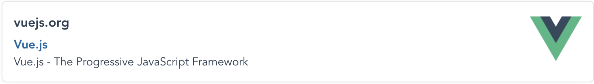

<p align="left">
  
</p>

> For use with `Vue 2`, Use the v2 instructions [here](https://github.com/ashwamegh/vue-link-preview/tree/v2).

# Vue Link Preview

A Vuejs component to fetch metadata from a URL and preview it

Inspired by [link-preview-generator](https://github.com/AndrejGajdos/link-preview-generator) and [link-prevue](https://github.com/nivaldomartinez/link-prevue) 🙏

[](https://opensource.org/licenses/mit-license.php)
[](https://github.com/ashwamegh/vue-link-preview/)
[](https://travis-ci.org/github/ashwamegh/link-preview-vue)
[](https://www.npmjs.com/package/@ashwamegh/vue-link-preview)
[](https://app.netlify.com/sites/link-preview/deploys)
<br>
<a href="https://www.buymeacoffee.com/ashwamegh" target="_blank"></a>

> **<ins>NOTE: This utilizes https://github.com/ashwamegh/link-preview-generator-server server deployed on Azure, a free web server which can run 30 minutes in a day.</ins> If you want to use it in a PRODUCTION app, I would recommend you to use your own server (You can use the [`Dockerfile`](https://github.com/ashwamegh/link-preview-generator-server/blob/master/Dockerfile) or the [Docker hub image](https://hub.docker.com/repository/docker/ashwamegh/lpdg-server) for deploying [link-preview-generator-server](https://github.com/ashwamegh/link-preview-generator-server)) and provide the custom link of the API for `customDomain` in the Component Props**

## Demo

## Table of Contents

-   [Install](#install)
-   [Usage](#usage)
-   [Props](#props)
-   [Events](#events)
-   [Contribute](#contribute)
-   [License](#license)

## Install

### NPM

```sh
npm install @ashwamegh/vue-link-preview
```

### Yarn

```sh
yarn add @ashwamegh/vue-link-preview
```

### UMD build

```html
<script src="https://unpkg.com/@ashwamegh/vue-link-preview/dist/vuelinkpreview.umd.js"></script>
```

## Usage

### With Options API

```vue
<script>
import LinkPreview from "@ashwamegh/vue-link-preview";

export default {
    components: {
        LinkPreview
    },
    methods: {
        handleClick(preview) {
            console.log(
                "click",
                preview.domain,
                preview.title,
                preview.description,
                preview.img
            );
        }
    }
};
</script>
<template>
<div id="app">
    <vue-link-preview
        url="https://vuejs.org/"
        @on-click="handleClick"
    ></vue-link-preview>
</div>
</template>
```

### With Composition API

```vue
<script setup>
import LinkPreview from "@ashwamegh/vue-link-preview";

const handleClick = preview => {
    console.log(
        "click",
        preview.domain,
        preview.title,
        preview.description,
        preview.img
    );
};
</script>

<template>
    <div id="app">
        <LinkPreview url="https://vuejs.org/" @on-click="handleClick">
        </LinkPreview>
    </div>
</template>
```

### With custom layout (With Vue Slots)

For replacing the Loader, you can add this html:

```html
<vue-link-preview url="https://vuejs.org/" @on-click="handleClick">
    <template v-slot:loader>
        loader...
    </template>
</vue-link-preview>

<!------------------- OR USE THIS ------------------->

<LinkPreview url="https://vuejs.org/" @on-click="handleClick">
    <template v-slot:loader>
        loader...
    </template>
</LinkPreview>
```

For replacing the content layout, you can use this:

```html
<vue-link-preview url="https://vuejs.org/" @on-click="handleClick">
    <template v-slot:default="preview">
        <div>
            <p>Domain: {{ preview.domain }}</p>
            <p>Title: {{ preview.title }}</p>
            <p>Description: {{ preview.description }}</p>
            
        </div>
    </template>
</vue-link-preview>
```

All together with loader and default slot, it'll look like this:

```html
<vue-link-preview url="https://vuejs.org/" @on-click="handleClick">
    <template v-slot:loader>
        loader...
    </template>
    <template v-slot:default="preview">
        <div>
            <p>Domain: {{ preview.domain }}</p>
            <p>Title: {{ preview.title }}</p>
            <p>Description: {{ preview.description }}</p>
            
        </div>
    </template>
</vue-link-preview>
```


## More Examples [here](https://github.com/ashwamegh/vue-link-preview/tree/main/examples)

## Props

| Property       | Type      | Default                                            | Description                                                     | Required |
| -------------- | --------- | -------------------------------------------------- | --------------------------------------------------------------- | -------- |
| `url`          | `string`  |                                                    | URL of the page you need the preview for                        | true     |
| `customDomain` | `string`  | `https://lpdg-server.azurewebsites.net/parse/link` | Custom Server API link which can parse the metadata of the page | false    |
| `width`        | `string`  | `90%`                                              | Width of the card preview                                       | false    |
| `maxWidth`     | `string`  | `700px`                                            | Max Width of the card preview                                   | false    |
| `marginTop`    | `string`  | `18px`                                             | Margin top for the card                                         | false    |
| `marginBottom` | `string`  | `18px`                                             | Margin bottom for the card                                      | false    |
| `marginRight`  | `string`  | `18px`                                             | Margin right for the card                                       | false    |
| `marginLeft`   | `string`  | `18px`                                             | Margin left for the card                                        | false    |
| `canOpenLink`  | `boolean` | `true`                                             | Enables, to open link when clicked on card                      | false    |

## Events

| Name      | Description               |
| -------   | ------------------------- |
| `onClick` | It emits the preview data |

> Note: If you want to use `click` event without opening the url, then pass `:canOpenLink="false"` in the props

## Contribute

Thanks for taking the time to contribute, please check out the [src](src) to understand how things work.

### Reporting Issues

Found a problem? Want a new feature? First of all, see if your issue or idea has [already been reported](../../issues).
If don't, just open a [new clear and descriptive issue](../../issues/new).

### Submitting pull requests

Pull requests are the greatest contributions, so be sure they are focused in scope and do avoid unrelated commits.

-   Fork it!
-   Clone your fork: `git clone https://github.com/<your-username>/vue-link-preview`
-   Navigate to the newly cloned directory: `cd vue-link-preview`
-   Create a new branch for the new feature: `git checkout -b my-new-feature`
-   Install the tools necessary for development: `yarn`
-   Make your changes.
-   Commit your changes: `git commit -am 'Add some feature'`
-   Push to the branch: `git push origin my-new-feature`
-   Submit a pull request with full remarks documenting your changes

## License

[MIT License](https://opensource.org/licenses/MIT) © [Shashank Shekhar](https://ashwamegh.github.io)
